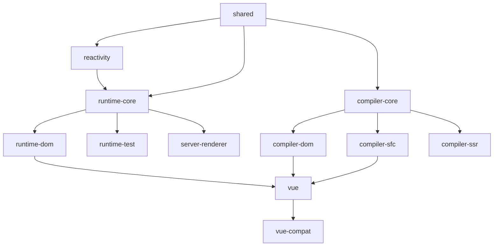

# Vue 3 项目结构详解

> Vue 3 核心源码项目的完整目录结构和文件说明

## 📁 项目根目录结构

```
vue3/
├── 📁 .codebuddy/           # CodeBuddy AI 助手配置
├── 📁 .git/                 # Git 版本控制
├── 📁 .github/              # GitHub 配置和工作流
├── 📁 .vscode/              # VS Code 编辑器配置
├── 📁 .well-known/          # 标准化网络协议目录
├── 📁 changelogs/           # 历史版本变更日志
├── 📁 node_modules/         # 依赖包目录
├── 📁 packages/             # 核心包源码 ⭐
├── 📁 packages-private/     # 私有包和工具
├── 📁 scripts/              # 构建和开发脚本
├── 📁 temp/                 # 临时文件目录
└── 📄 各种配置文件...
```

---

## 🎯 核心目录详解

### 📦 `packages/` - 核心包目录

Vue 3 采用 **Monorepo** 架构，将功能拆分为多个独立的包：

#### **响应式系统**
- **`reactivity/`** - 响应式系统核心
  - 实现 `reactive`、`ref`、`computed`、`watch` 等 API
  - 基于 Proxy 的响应式机制
  - 副作用系统 (effect system)

#### **运行时系统**
- **`runtime-core/`** - 运行时核心 ⭐
  - 组件系统、虚拟 DOM、渲染器
  - 生命周期、依赖注入、插件系统
  - 平台无关的核心逻辑

- **`runtime-dom/`** - DOM 运行时
  - 浏览器特定的实现
  - DOM 操作、事件处理、属性更新
  - 与 `runtime-core` 结合形成完整的浏览器运行时

- **`runtime-test/`** - 测试运行时
  - 用于单元测试的轻量级运行时
  - 模拟 DOM 环境，不依赖真实浏览器

#### **编译系统**
- **`compiler-core/`** - 编译器核心
  - 模板 AST 解析和转换
  - 代码生成器
  - 平台无关的编译逻辑

- **`compiler-dom/`** - DOM 编译器
  - 浏览器特定的编译优化
  - DOM 相关的转换和优化

- **`compiler-sfc/`** - 单文件组件编译器
  - `.vue` 文件解析和编译
  - `<template>`、`<script>`、`<style>` 块处理
  - CSS 作用域、CSS Modules 支持

- **`compiler-ssr/`** - 服务端渲染编译器
  - SSR 特定的编译优化
  - 静态提升、内联组件优化

#### **其他核心包**
- **`shared/`** - 共享工具库
  - 通用工具函数和常量
  - 类型定义和辅助函数

- **`server-renderer/`** - 服务端渲染
  - SSR 渲染器实现
  - 流式渲染支持

- **`vue/`** - 完整构建版本
  - 整合所有功能的完整版本
  - 包含编译器和运行时

- **`vue-compat/`** - Vue 2 兼容层
  - Vue 2 到 Vue 3 的迁移支持
  - 兼容性 API 实现

### 🔧 `packages-private/` - 私有包目录

内部工具和测试包，不对外发布：

- **`dts-built-test/`** - TypeScript 类型定义测试
- **`dts-test/`** - 类型测试工具
- **`sfc-playground/`** - SFC 在线演示场
- **`template-explorer/`** - 模板编译器在线工具
- **`vite-debug/`** - Vite 调试工具

### 📜 `scripts/` - 构建脚本目录

自动化构建和开发工具：

- **`build.js`** - 主构建脚本
- **`dev.js`** - 开发模式脚本
- **`release.js`** - 发布脚本
- **`utils.js`** - 构建工具函数
- **`aliases.js`** - 路径别名配置
- **`inline-enums.js`** - 枚举内联处理

---

## 📄 根目录配置文件详解

### **包管理配置**
- **`package.json`** - 项目主配置文件
  - 依赖管理、脚本定义、项目元信息
  - 使用 pnpm 作为包管理器
- **`pnpm-workspace.yaml`** - pnpm 工作空间配置
- **`pnpm-lock.yaml`** - 依赖锁定文件

### **构建配置**
- **`rollup.config.js`** - Rollup 主构建配置 ⭐
  - 多格式输出配置 (ESM、CJS、IIFE)
  - 插件配置和优化设置
- **`rollup.dts.config.js`** - TypeScript 声明文件构建配置

### **TypeScript 配置**
- **`tsconfig.json`** - 开发环境 TS 配置
- **`tsconfig.build.json`** - 构建环境 TS 配置

### **代码质量配置**
- **`eslint.config.js`** - ESLint 代码检查配置
- **`.prettierrc`** - Prettier 代码格式化配置
- **`.prettierignore`** - Prettier 忽略文件配置
- **`vitest.config.ts`** - Vitest 测试框架配置

### **版本控制配置**
- **`.gitignore`** - Git 忽略文件配置
- **`.git-blame-ignore-revs`** - Git blame 忽略的提交

### **项目文档**
- **`README.md`** - 项目说明文档
- **`CHANGELOG.md`** - 版本变更日志
- **`LICENSE`** - 开源协议 (MIT)
- **`SECURITY.md`** - 安全政策说明
- **`BACKERS.md`** - 赞助商信息
- **`FUNDING.json`** - 资助信息配置

### **部署配置**
- **`netlify.toml`** - Netlify 部署配置
- **`.node-version`** - Node.js 版本锁定

### **其他配置**
- **`.well-known/funding-manifest-urls`** - 资助信息清单 URL

---

## 🔄 包依赖关系图



---

## 🚀 构建系统特点

### **多格式输出**
每个包都会构建出多种格式：
- **`esm-bundler`** - 供打包工具使用的 ES 模块
- **`esm-browser`** - 供浏览器直接使用的 ES 模块
- **`cjs`** - CommonJS 格式 (Node.js)
- **`global`** - IIFE 格式 (全局变量)
- **`runtime-only`** - 仅运行时版本

### **特性标志系统**
通过编译时常量实现条件编译：
- `__DEV__` - 开发/生产环境
- `__BROWSER__` - 浏览器/Node 环境
- `__FEATURE_*` - 功能特性开关

### **开发工具链**
- **热重载开发** - `pnpm dev`
- **类型检查** - TypeScript 严格模式
- **代码质量** - ESLint + Prettier
- **自动化测试** - Vitest 单元测试
- **性能基准** - 内置 benchmark 测试

---

## 📚 学习建议

### **推荐学习顺序**
1. **`shared/`** - 了解工具函数和常量
2. **`reactivity/`** - 理解响应式系统核心
3. **`runtime-core/`** - 掌握组件系统和渲染器
4. **`compiler-core/`** - 学习模板编译原理
5. **`runtime-dom/`** - 了解浏览器特定实现

### **调试技巧**
```bash
# 构建开发版本
pnpm build reactivity --devOnly

# 启用 source map
pnpm build reactivity --sourceMap

# 运行特定包的测试
pnpm test packages/reactivity
```

### **关键入口文件**
- `packages/reactivity/src/index.ts` - 响应式 API 入口
- `packages/runtime-core/src/index.ts` - 运行时 API 入口
- `packages/vue/src/index.ts` - 完整版 Vue API 入口

---

## 🎯 总结

Vue 3 采用现代化的 Monorepo 架构，具有以下特点：

✅ **模块化设计** - 功能拆分，职责清晰  
✅ **多格式构建** - 适应不同使用场景  
✅ **类型安全** - 完整的 TypeScript 支持  
✅ **开发友好** - 丰富的开发工具和脚本  
✅ **性能优化** - 编译时优化和运行时优化并重  

这种架构设计使得 Vue 3 既保持了整体的一致性，又具备了良好的可维护性和扩展性。