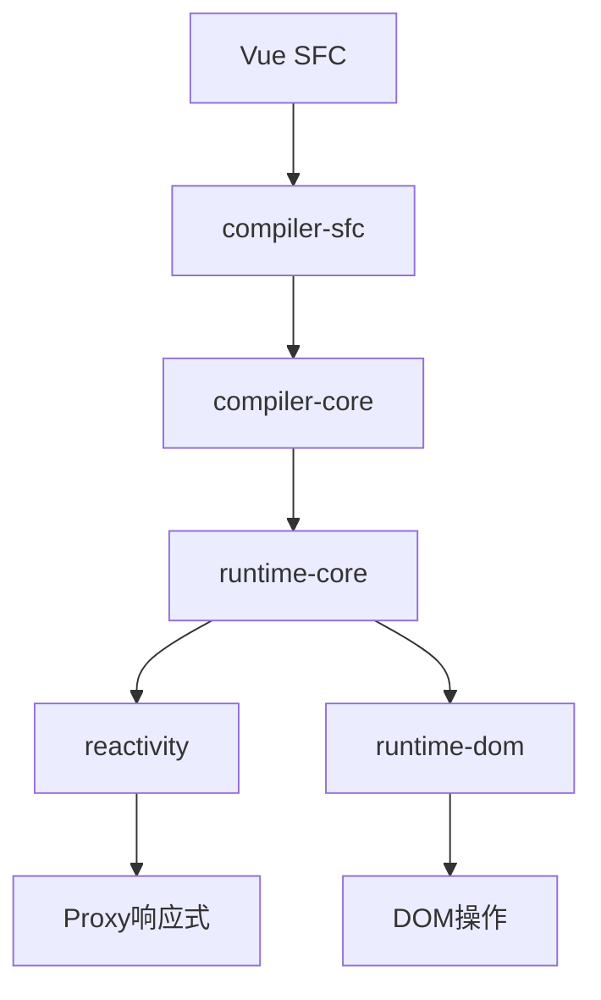

# Vue3 源码学习指南

> 🎯 本指南帮助你系统地学习和理解 Vue3 源码

## 📚 目录

- [1. 核心架构概览](#1-核心架构概览)
- [2. 关键技术解析](#2-关键技术解析)
- [3. 源码阅读指南](#3-源码阅读指南)
- [4. 实践学习建议](#4-实践学习建议)
- [5. 学习路径总结](#5-学习路径总结)

---

## 1. 核心架构概览

### 1.1 整体架构设计

Vue3采用了模块化的monorepo架构，主要包含以下核心模块：

```
packages/
├── reactivity/          # 响应式系统
├── runtime-core/        # 运行时核心
├── runtime-dom/         # DOM相关运行时
├── compiler-core/       # 编译器核心
├── compiler-dom/        # DOM编译器
├── compiler-sfc/        # 单文件组件编译器
├── shared/             # 共享工具函数
└── vue/                # 完整构建版本
```

### 1.2 核心模块交互关系



**模块职责分工：**

- **reactivity**: 实现响应式系统，基于Proxy的数据劫持
- **runtime-core**: 组件系统、虚拟DOM、生命周期等核心逻辑
- **runtime-dom**: 浏览器DOM操作的具体实现
- **compiler-core**: 模板编译的核心逻辑
- **compiler-dom**: DOM相关的编译优化
- **shared**: 跨模块共享的工具函数

### 1.3 Composition API架构

Composition API通过以下方式重新组织了Vue的API设计：

```javascript
// 传统Options API
export default {
  data() { return { count: 0 } },
  methods: { increment() { this.count++ } }
}

// Composition API
import { ref } from 'vue'
export default {
  setup() {
    const count = ref(0)
    const increment = () => count.value++
    return { count, increment }
  }
}
```

---

## 2. 关键技术解析

### 2.1 响应式系统实现原理

#### Proxy vs Object.defineProperty对比

| 特性          | Object.defineProperty | Proxy            |
| ------------- | --------------------- | ---------------- |
| 监听范围      | 只能监听对象属性      | 可监听整个对象   |
| 数组支持      | 需要特殊处理          | 原生支持         |
| 属性添加/删除 | 无法监听              | 可以监听         |
| 性能          | 需要递归遍历          | 懒代理，按需监听 |
| 兼容性        | IE8+                  | IE11+            |

#### 核心实现机制

```javascript
// packages/reactivity/src/reactive.ts
function createReactiveObject(target, handlers) {
  return new Proxy(target, handlers)
}

// 响应式处理器
const mutableHandlers = {
  get(target, key, receiver) {
    // 依赖收集
    track(target, 'get', key)
    return Reflect.get(target, key, receiver)
  },
  set(target, key, value, receiver) {
    const result = Reflect.set(target, key, value, receiver)
    // 触发更新
    trigger(target, 'set', key, value)
    return result
  },
}
```

### 2.2 Composition API设计思想

#### 核心设计原则

1. **逻辑复用**: 通过组合函数实现逻辑复用
2. **类型推导**: 更好的TypeScript支持
3. **Tree-shaking**: 按需引入，减少包体积
4. **灵活性**: 不受this绑定限制

#### 实现机制

```javascript
// packages/runtime-core/src/apiSetup.ts
function setupComponent(instance) {
  const { setup } = instance.type
  if (setup) {
    const setupResult = setup(instance.props, setupContext)
    handleSetupResult(instance, setupResult)
  }
}
```

### 2.3 虚拟DOM优化

#### PatchFlag优化

Vue3引入了PatchFlag来标记动态内容：

```javascript
// 编译结果示例
function render() {
  return createVNode('div', null, [
    createVNode('span', null, _ctx.msg, 1 /* TEXT */),
    createVNode('span', { class: _ctx.cls }, null, 2 /* CLASS */),
  ])
}
```

#### 静态提升(hoistStatic)

```javascript
// 编译前
;<div>
  <span>静态文本</span>
  <span>{{ msg }}</span>
</div>

// 编译后（静态提升）
const _hoisted_1 = createVNode('span', null, '静态文本')
function render() {
  return createVNode('div', null, [
    _hoisted_1, // 静态节点被提升
    createVNode('span', null, _ctx.msg, 1 /* TEXT */),
  ])
}
```

### 2.4 编译时优化策略

1. **Block Tree**: 将动态节点收集到Block中，减少遍历
2. **Dead Code Elimination**: 移除未使用的代码
3. **Inline Props**: 内联组件props优化
4. **Cache Event Handlers**: 缓存事件处理器

---

## 3. 源码阅读指南

### 3.1 推荐阅读顺序

#### 第一阶段：基础理解

1. **packages/shared/src/index.ts** - 了解工具函数
2. **packages/reactivity/src/reactive.ts** - 响应式系统入口
3. **packages/reactivity/src/effect.ts** - 副作用系统
4. **packages/reactivity/src/ref.ts** - ref实现

#### 第二阶段：运行时核心

1. **packages/runtime-core/src/vnode.ts** - 虚拟DOM定义
2. **packages/runtime-core/src/component.ts** - 组件系统
3. **packages/runtime-core/src/renderer.ts** - 渲染器核心
4. **packages/runtime-core/src/apiSetup.ts** - Composition API

#### 第三阶段：编译系统

1. **packages/compiler-core/src/parse.ts** - 模板解析
2. **packages/compiler-core/src/transform.ts** - AST转换
3. **packages/compiler-core/src/codegen.ts** - 代码生成
4. **packages/compiler-sfc/src/compileScript.ts** - SFC编译

### 3.2 关键函数与实现技巧

#### 响应式系统关键函数

```javascript
// packages/reactivity/src/effect.ts
export function track(target, type, key) {
  // 依赖收集的核心逻辑
}

export function trigger(target, type, key, newValue) {
  // 触发更新的核心逻辑
}
```

#### 渲染系统关键函数

```javascript
// packages/runtime-core/src/renderer.ts
function patch(n1, n2, container, anchor) {
  // diff算法的核心实现
}

function mountComponent(initialVNode, container, anchor) {
  // 组件挂载逻辑
}
```

### 3.3 调试技巧

1. **使用Vue DevTools**: 观察组件状态和响应式数据
2. **源码断点调试**: 在关键函数设置断点
3. **单元测试学习**: 通过测试用例理解API行为
4. **构建调试版本**: 使用未压缩版本进行调试

---

## 4. 实践学习建议

### 4.1 学习顺序与方法

#### 推荐学习顺序

这是一个自顶向下的学习方法，分为四个阶段：

**第一阶段: 项目结构认知 ✅**

1. 先熟悉 `packages/` 目录结构
   - `reactivity` (响应式系统)
   - `runtime-core` (运行时核心)
   - `runtime-dom` (DOM 运行时)
   - `compiler-core` (编译器核心)
   - `compiler-dom` (DOM 编译器)
   - `shared` (共享工具)
2. 理解包之间的依赖关系
   - `shared` → `reactivity` → `runtime-core` → `runtime-dom`
   - `compiler-core` → `compiler-dom`

**第二阶段: 构建系统理解 ✅**

1. 核心配置文件:
   - `rollup.config.js` (主构建配置)
   - `scripts/build.js` (构建脚本)
   - `tsconfig.json` (TypeScript 配置)
2. 理解构建流程:
   - 多包并行构建
   - 多种不同格式输出
   - 特性标志系统
   - 条件编译机制

**第三阶段: 实际构建体验**

```bash
# 构建单个包体验
pnpm build reactivity

# 构建特定格式
pnpm build runtime-core --formats esm-bundler

# 查看构建产物
ls packages/reactivity/dist/

# 对比开发/生产构建
pnpm build reactivity --devOnly
pnpm build reactivity --prodOnly

# 生成类型声明（支持的包）
pnpm build vue --withTypes
```

**第四阶段: 核心包学习**

建议学习顺序:

1. `shared` (工具函数) - 最简单，建立信心
   - 额外建议：快速浏览 `packages/vue`（聚合入口与对外导出），建立"对外 API"全局视角
2. `reactivity` (响应式) - Vue 3 的核心创新
3. `runtime-core` (运行时) - 组件系统核心
4. `compiler-core` (编译器) - 模板编译
5. `runtime-dom` (DOM操作) - 浏览器特定实现

### 4.2 学习技巧建议

#### 1. 使用调试工具

```bash
# 开启 source map
pnpm build reactivity --sourceMap

# 构建开发版本
pnpm build reactivity --devOnly
```

#### 2. 理解特性标志

在学习源码时，注意这些编译时常量（不同构建目标会裁剪不同分支):

- `__DEV__` - 开发/生产环境
- `__TEST__` - 测试环境分支（vitest等）
- `__COMPAT__` - 兼容层启用（2.x 兼容）
- `__FEATURE_OPTIONS_API__` / `__VUE_OPTIONS_API__` - 选项式 API 支持
- `__FEATURE_PROD_DEVTOOLS__` - 生产环境是否启用 devtools 钩子
- `__ESM_BUNDLER__` - ESM bundler 构建特定逻辑

#### 3. 从测试用例入手

每个包的 `__tests__` 目录是理解API的最佳入口:

```
packages/reactivity/__tests__/
packages/runtime-core/__tests__/
```

#### 4. 关注核心概念

- 响应式系统: `Proxy`, `effect`, `track`, `trigger`
- 组件系统: `VNode`, 组件实例, 生命周期
- 编译系统: `AST`, `transform`, `codegen`

### 4.3 源码调试实践

#### 环境搭建

```bash
# 克隆源码
git clone https://github.com/vuejs/core.git
cd core

# 安装依赖
npm install

# 构建开发版本
npm run build

# 运行测试
npm run test
```

#### 调试步骤

1. 在`packages/vue/examples`中创建测试页面
2. 引入开发版本的Vue
3. 在源码中添加`debugger`或`console.log`
4. 使用浏览器开发者工具调试

### 4.4 仿写核心功能

#### 实现简化版响应式系统

```javascript
// 简化版reactive实现
function reactive(target) {
  return new Proxy(target, {
    get(target, key) {
      track(target, key)
      return target[key]
    },
    set(target, key, value) {
      target[key] = value
      trigger(target, key)
      return true
    },
  })
}

let activeEffect = null
const targetMap = new WeakMap()

function track(target, key) {
  if (!activeEffect) return
  let depsMap = targetMap.get(target)
  if (!depsMap) {
    targetMap.set(target, (depsMap = new Map()))
  }
  let dep = depsMap.get(key)
  if (!dep) {
    depsMap.set(key, (dep = new Set()))
  }
  dep.add(activeEffect)
}

function trigger(target, key) {
  const depsMap = targetMap.get(target)
  if (!depsMap) return
  const dep = depsMap.get(key)
  if (dep) {
    dep.forEach(effect => effect())
  }
}

function effect(fn) {
  activeEffect = fn
  fn()
  activeEffect = null
}
```

### 4.5 学习重点建议

**必须掌握的核心文件:**

```
packages/reactivity/src/
├── effect.ts       # 副作用系统
├── reactive.ts     # 响应式对象
└── ref.ts          # ref 实现
```

```
packages/runtime-core/src/
├── component.ts    # 组件实例
├── vnode.ts        # 虚拟DOM
└── renderer.ts     # 渲染器
```

**可以后续深入的:**

- `compiler-*` 包（建议优先看 `compiler-sfc` 与 `compiler-core` 的协作，再扩展到 `compiler-dom`）
- `server-renderer` (SSR相关)
- `vue-compat` (兼容性处理)

### 4.6 参与社区讨论

1. **GitHub Issues**: 关注Vue3的issue讨论
2. **RFC文档**: 阅读Vue的RFC提案
3. **技术博客**: 分享学习心得和源码解析
4. **开源贡献**: 提交bug修复或功能改进

### 4.7 优质学习资源推荐

#### 官方资源

1. **Vue3官方文档**: https://vuejs.org/
2. **Vue3 RFC**: https://github.com/vuejs/rfcs
3. **Vue3源码**: https://github.com/vuejs/core

#### 技术文章

1. **Vue3源码解析系列** - 霍春阳
2. **Vue.js设计与实现** - HcySunYang
3. **Vue3响应式原理深度解析** - 各大技术博客

#### 开源项目

1. **mini-vue**: https://github.com/cuixiaorui/mini-vue
2. **vue-next-analysis**: Vue3源码分析项目
3. **vue3-source-code-analysis**: 详细的源码注释版本

#### 视频教程

1. **Vue3源码解析** - 各大在线教育平台
2. **Composition API深入理解** - 技术分享视频
3. **Vue3编译优化原理** - 会议演讲视频

---

## 5. 学习路径总结

### 初级阶段（1-2周）

- 熟悉项目结构和模块划分
- 理解响应式系统基本原理
- 掌握Composition API使用

### 中级阶段（3-4周）

- 深入理解虚拟DOM和diff算法
- 学习编译系统工作原理
- 实践源码调试技巧

### 高级阶段（5-8周）

- 仿写核心功能模块
- 参与开源项目贡献
- 深入理解性能优化策略

### 持续学习

- 关注Vue生态发展
- 参与技术社区讨论
- 分享学习成果和心得

---

通过系统化的学习Vue3源码，不仅能深入理解现代前端框架的设计思想，还能提升整体的技术架构能力和代码质量意识。

备注：原始内容可以查看提交记录（学习笔记）（docs: 添加 Vue 3 源码学习文档和可视化工具）
