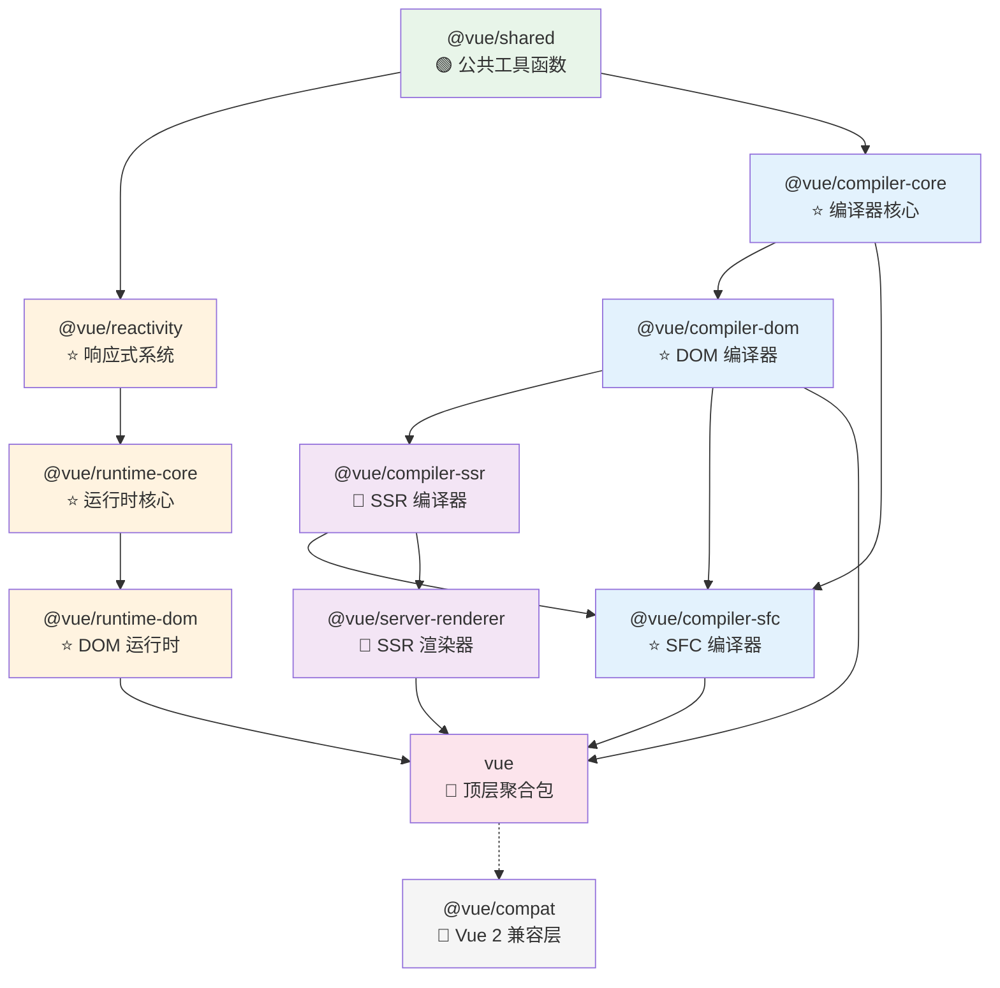

# 常见框架/项目类型的分析策略

不同类型的项目有不同的分析切入点。本文档提供针对性的分析策略指引。

## 目录
- [1. 前端框架（Vue/React/Svelte/Angular）](#1-前端框架)
- [2. 构建工具（Webpack/Vite/Rollup/esbuild）](#2-构建工具)
- [3. 状态管理库（Redux/Pinia/MobX/Zustand）](#3-状态管理库)
- [4. Node.js 后端框架（Express/Koa/Nest/Fastify）](#4-nodejs-后端框架)
- [5. 编程语言/编译器](#5-编程语言编译器)
- [6. 工具库（lodash/dayjs/axios）](#6-工具库)
- [7. Monorepo 项目](#7-monorepo-项目)
- [8. Rust/Go/Python 项目](#8-rustgopython-项目)

---

## 1. 前端框架

**典型代表：** Vue、React、Svelte、Angular、Solid

### 核心分析维度

1. **响应式/状态系统**——这是前端框架的灵魂
   - 数据变化是如何被检测到的？（Proxy / Signals / Virtual DOM diff / Compiler）
   - 依赖追踪机制是什么？（自动 vs 手动）
   - 批量更新策略是什么？（微任务/宏任务/同步）

2. **组件模型**
   - 组件的生命周期是怎样的？
   - 父子组件如何通信？
   - 组件实例上有哪些关键属性？

3. **渲染系统**
   - 有没有虚拟 DOM？如果有，diff 算法是什么策略？
   - 如果没有（如 Svelte），编译时做了什么？
   - DOM 更新是同步还是异步？

4. **编译器（如果有）**
   - 模板/JSX/语法糖是如何被编译的？
   - 编译时做了哪些优化？
   - 输出的运行时代码是什么样的？

### 推荐学习路径
```
shared/工具函数 → 响应式系统 → 组件系统 → 渲染器 → 编译器
```

### Vue 特有关注点
- `reactivity` 包：Proxy 的 handler 实现、effect/track/trigger 三角关系
- `runtime-core` 包：`createApp` 启动流程、`patch` 函数的 diff 逻辑
- `compiler-core` 包：模板 → AST → transform → codegen 的编译管道
- 特性标志系统：`__DEV__`、`__FEATURE_OPTIONS_API__` 等条件编译

### Vue 3 完整运行链路

Vue 3 内部有两条核心链路：

**链路一：编译时（.vue 文件 → 可执行的 JS）**
```
.vue 文件
  → compiler-sfc（拆分 template/script/style 三个块）
    → compiler-core（template → AST → transform 优化）
      → compiler-dom（注入 DOM 特有的转换规则）
        → codegen 生成 render 函数代码
```

**链路二：运行时（JS 代码 → 浏览器 DOM）**
```
createApp(App).mount('#app')
  → runtime-core（创建应用实例、组件实例、执行 setup）
    → reactivity（建立响应式数据、依赖追踪）
      → runtime-core（执行 render 函数、生成 VNode 树）
        → runtime-dom（patch VNode → 真实 DOM 操作）
数据变更时：
  → reactivity（检测到变化、触发 effect）
    → runtime-core（重新执行 render、diff 新旧 VNode）
      → runtime-dom（最小化 DOM 更新）
```

### Vue 3 包依赖关系图



图例说明：
- 🟠 暖色（运行时线）：`shared` → `reactivity` → `runtime-core` → `runtime-dom`
- 🔵 冷色（编译器线）：`shared` → `compiler-core` → `compiler-dom` → `compiler-sfc`
- 🟣 紫色（SSR 支线）：`compiler-ssr` + `server-renderer`
- 🔴 红色（聚合入口）：`vue` 包汇聚运行时 + 编译器
- ⭐ 必读模块 / 📖 选读模块

### Vue 3 模块速查表

| 模块 | 一句话职责 | 优先级 | 复杂度 |
|------|-----------|--------|--------|
| `shared` | 跨包共享的工具函数（类型判断、字符串处理等） | 🟢 先扫 | 🟢简单 |
| `reactivity` | Proxy 响应式系统（ref/reactive/computed/effect） | ⭐必读 | 🟡中等 |
| `compiler-core` | 模板编译管道（parse → transform → codegen） | ⭐必读 | 🔴复杂 |
| `compiler-dom` | DOM 平台特有的编译转换规则 | ⭐必读 | 🟡中等 |
| `compiler-sfc` | .vue 单文件组件的解析和编译 | ⭐必读 | 🟡中等 |
| `runtime-core` | 组件系统、VNode、diff/patch、调度器 | ⭐必读 | 🔴复杂 |
| `runtime-dom` | 浏览器 DOM 操作（创建/更新/删除元素） | ⭐必读 | 🟡中等 |
| `compiler-ssr` | 服务端渲染的编译优化 | 📖选读 | 🟡中等 |
| `server-renderer` | Node.js 环境的 HTML 字符串渲染 | 📖选读 | 🟡中等 |
| `vue-compat` | Vue 2 → Vue 3 迁移兼容层 | 📖选读 | 🟡中等 |

### Vue 3 入口文件索引

| 子系统 | 入口文件 | 从这里开始看 |
|--------|----------|-------------|
| 响应式 | `packages/reactivity/src/index.ts` | `ref()`、`reactive()` 的实现 |
| 运行时核心 | `packages/runtime-core/src/index.ts` | `createApp()`、`h()` 的实现 |
| DOM 运行时 | `packages/runtime-dom/src/index.ts` | `render()`、DOM 操作封装 |
| 编译器核心 | `packages/compiler-core/src/index.ts` | `baseParse()`、`baseCompile()` |
| DOM 编译器 | `packages/compiler-dom/src/index.ts` | `compile()` 完整编译入口 |
| SFC 编译 | `packages/compiler-sfc/src/index.ts` | `parse()`（SFC 解析）、`compileScript()` |
| 顶层包 | `packages/vue/src/index.ts` | 聚合导出，看这里了解对外暴露了什么 |

### Vue 3 推荐学习路径

```
第一步：shared（热身，了解项目的工具函数风格）
  ↓
第二步：reactivity（Vue 的灵魂，独立性强，最适合入门深读）
  ↓
第三步：runtime-core（理解组件如何创建、VNode 如何 diff）
  ↓
第四步：runtime-dom（看运行时如何对接真实 DOM）
  ↓
第五步：compiler-core（理解模板编译管道 parse → transform → codegen）
  ↓
第六步：compiler-dom / compiler-sfc（编译器的 DOM 特化和 SFC 处理）
  ↓
可选：compiler-ssr / server-renderer（SSR 场景）
```

### React 特有关注点
- Fiber 架构：链表结构、工作循环、优先级调度
- Hooks 实现：链表存储、依赖数组对比
- 并发模式：时间切片、Suspense、Transition

---

## 2. 构建工具

**典型代表：** Webpack、Vite、Rollup、esbuild、Turbopack

### 核心分析维度

1. **模块解析**——如何找到和读取源文件
   - 文件解析策略（resolve）
   - 模块图构建过程

2. **转换管道**——如何处理不同类型的文件
   - plugin/loader 系统设计
   - 转换链的执行顺序

3. **打包策略**——如何将多个模块合并
   - Tree shaking 实现
   - Code splitting 策略
   - Chunk 生成算法

4. **开发服务器（如果有）**
   - HMR（热模块替换）实现
   - 文件监听和增量编译

### 推荐学习路径
```
配置解析 → 模块解析 → 转换管道 → 打包/输出 → 开发服务器
```

---

## 3. 状态管理库

**典型代表：** Redux、Pinia、MobX、Zustand、Jotai

### 核心分析维度

1. **Store 设计**——状态如何存储和组织
2. **变更机制**——如何安全地修改状态（dispatch/action/mutation）
3. **订阅机制**——组件如何监听状态变化并重渲染
4. **中间件/插件**——如何扩展功能（日志、持久化、时间旅行）
5. **DevTools 集成**——如何支持开发调试

### 推荐学习路径
```
Store 创建 → 状态读取 → 状态变更 → 订阅通知 → 中间件系统
```

---

## 4. Node.js 后端框架

**典型代表：** Express、Koa、NestJS、Fastify、Hono

### 核心分析维度

1. **请求处理管道**——请求从进来到响应的完整流程
2. **中间件系统**——洋葱模型/瀑布模型的实现
3. **路由系统**——URL 匹配和参数解析
4. **错误处理**——全局错误捕获和处理策略
5. **插件架构**——如何扩展框架能力

### 推荐学习路径
```
应用创建 → 中间件注册 → 路由匹配 → 请求处理 → 响应发送 → 错误处理
```

---

## 5. 编程语言/编译器

**典型代表：** TypeScript、Babel、SWC、Prettier、ESLint

### 核心分析维度

1. **词法分析（Lexer/Tokenizer）**——源码 → Token 流
2. **语法分析（Parser）**——Token 流 → AST
3. **语义分析/类型检查**——AST 上的验证和推导
4. **转换（Transform）**——AST → AST（优化、降级）
5. **代码生成（Codegen）**——AST → 目标代码

### 推荐学习路径
```
AST 结构 → Parser → Transform → Codegen → 类型系统（如果有）
```

---

## 6. 工具库

**典型代表：** lodash、dayjs、axios、zod、p-limit

### 核心分析维度

1. **API 设计**——接口如何做到简洁易用
2. **边界处理**——如何处理各种极端输入
3. **性能优化**——是否有缓存、惰性计算等优化
4. **类型设计**——TypeScript 类型如何做到精确推导

### 分析策略
工具库通常每个函数相对独立，适合逐函数分析。推荐从最常用的 API 开始，直接看实现。测试文件是理解行为的最佳入口。

---

## 7. Monorepo 项目

Monorepo 项目有特殊的分析考量。

### 额外关注点

1. **工作空间配置**——`pnpm-workspace.yaml` / `lerna.json` / `nx.json`
2. **包间依赖**——内部包如何相互引用（workspace:* 协议）
3. **构建顺序**——是否有拓扑排序构建
4. **版本管理**——统一版本 vs 独立版本
5. **共享配置**——TSConfig、ESLint 等配置如何共享

### 分析策略
1. 先理清包的依赖图谱
2. 从最底层（无依赖）的包开始分析
3. 逐层向上，每层在理解了依赖包之后再分析

---

## 8. Rust/Go/Python 项目

### Rust 项目
- 入口：`Cargo.toml`（依赖）、`src/lib.rs` 或 `src/main.rs`（代码入口）
- 关注：所有权模型的应用、trait 设计、错误处理模式（Result/Option）
- 工具：`cargo doc --open` 生成文档

### Go 项目
- 入口：`go.mod`（依赖）、`main.go`（程序入口）或 `xxx.go`（库入口）
- 关注：接口设计、goroutine/channel 模式、error 处理
- 工具：`go doc` 查看文档

### Python 项目
- 入口：`pyproject.toml` / `setup.py`（包配置）、`__init__.py`（模块入口）
- 关注：装饰器模式、上下文管理器、元类运用
- 工具：`pydoc`、`help()` 交互查看

---

## 通用技巧

不管什么项目，以下技巧普遍适用：

1. **先看测试**：测试用例是理解行为的最佳文档
2. **先看类型**：TypeScript 类型/接口定义能快速了解数据结构
3. **先看入口**：入口文件暴露的 API 告诉你这个模块"想让你用什么"
4. **善用 git blame**：理解某段代码为什么这样写
5. **善用 git log --oneline --follow [file]**：了解一个文件的演化历史
6. **搜索 TODO/FIXME/HACK**：发现作者承认的技术债务和权衡取舍
